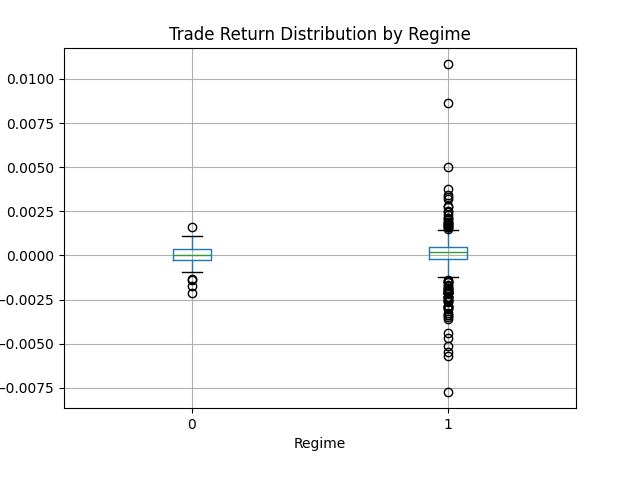

# Regime-Based Moving Average Strategy for CSI 300 Futures

## 1. Video Presentation Link
[YouTube Presentation Link](https://youtu.be/qqXvq-EAmIY)

---
## 2. How to Build and Run the Code
### Requirements
- Python 3.8+ (ensure you have a recent version of Python)
- `git` installed on your machine
- A working `make` tool (commonly available on Linux/macOS; on Windows, you may need `make` via WSL or Git Bash)

### Installation

1. **Clone the repository**:
    ```bash
    git clone https://github.com/zouhanq/zouhanq-Final-Project.git
    cd zouhanq-Final-Project
    ```

2. **Build and Setup Environment using Makefile**:  
   A `Makefile` is provided to streamline the setup:
    ```bash
    make setup
    ```
   This command will:
   - Create a Python virtual environment (if not existing).
   - Install required dependencies listed in `requirements.txt`.

3. **Activate the Virtual Environment** (if not automatically activated):
    ```bash
    source venv/bin/activate  # on Linux/macOS
    ```
    Or for Windows (PowerShell):
    ```powershell
    venv\Scripts\activate
    ```

### Running the Code

After setup, you can run the main script:
```bash
python main.py

```

## 3. Data Processing

### Data Loading and Cleaning
- **Data Source**: CSI 300 futures minute-level OHLC and volume data stored in data/mink.csv. Downloading manually from www.eastmoney.com
    - **Time**: The timestamp of the data point, indicating the specific minute.
    - **open**: The price of the instrument at the start of that minute.
    - **high**: The highest price reached during that minute.
    - **low**: The lowest price reached during that minute.
    - **close**: The final price of the instrument at the end of that minute.
    - **volume**: The number of contracts or units traded during that minute.
- **Cleaning**: Checked for missing values and forward-filled any gaps to ensure continuity.
  
### Feature Engineering
To better understand and respond to market conditions, several technical indicators were added to the dataset:
  - **RSI**: Used to gauge overbought and oversold conditions.
  - **Moving Averages (MA)**: Short (5-period) and Long (10-period) moving averages were used to identify trends.
  - **Bollinger Bands**: To detect potential mean-reverting opportunities.
  - **SVD Components**: Performed Singular Value Decomposition on key features to reduce dimensionality for clustering.
  - **VWAP**: Volume-Weighted Average Price 


I apply Singular Value Decomposition to reduce dimensionality and focus the model on key latent factors driving price movement.

---

## 4. Data Modeling Methods

### Regime Detection
Different strategies were implemented for each detected regime:
  - **K-means Clustering**: On the training set’s SVD components, I run K-Means to identify different market regimes (e.g., trending, mean-reverting). Each data point is assigned a regime label based on these clusters.
  - **Result**: Three regimes, potentially representing stable (low-volatility), trending (higher volatility), and mixed/moderate conditions.


### Modeling & Signals
#### Train/Test Split:
Data before 2024-01-01 is used for training, after for testing.

#### Model Training (Decision Tree):
I use a Decision Tree classifier trained on the training set only, predicting the next interval’s direction (up or down). This model uses the engineered features and the discovered regimes as inputs.

#### Incremental Processing on Test Set:
In real-time simulation:

  - For each incoming data row in the test period, I apply the same preprocessing, scaling, SVD transform, and regime prediction (from the trained models).
  - The Decision Tree then outputs a signal: 1 (buy) or -1 (sell).
  - A rule enforces that I cannot sell without having first bought.

### Backtesting & Performance Metrics
- I track cumulative returns by applying each predicted trade to a virtual portfolio, starting at 1.0 factor and adjusting after each closed trade.
- Final cumulative return and cumulative win rate is reported after the entire test period.
---


## 5. Preliminary Results


### Backtest Performance
#### Performance metrics
The cumulative profit over time chart reveals an Approximately +0.07 (7%), and the cumulative win rate over time chart reveals an steady state of 60% on the test data. this return is modest, but reaches the goal of positive return and attain an big improvement comparing to midterm. It shows the limitation of just incorporating MA or related indicators into a quant trading strategy.

#### Signal Distribution
We report the total number of buy and sell signals, providing transparency into the strategy’s frequency of trades.

### Conclusion
This project demonstrates a full data science lifecycle for a quantitative trading strategy:

- Data Collection and Cleaning
- Feature Engineering and Dimensionality Reduction
- Regime Detection with Clustering
- Predictive Modeling with Decision Trees
- Incremental, Realistic Backtesting and Performance Evaluation

The results show a modest positive return, suggesting that the combination of regime detection, technical indicators, and supervised learning can offer an edge in this market environment.


## 6. Preliminary Visualizations

### Cumulative Profit Over Time
This chart shows the cumulative profit over time for the regime-based moving average strategy. Although initially positive, the performance has been steadily declining, which suggests that the strategy may require further tuning.


### Trade Return Distribution by Regime
This boxplot shows that in both regimes, median trade returns cluster around zero, with some trades achieving modest gains and others small losses. Each regime exhibits its own pattern of variability and outliers, highlighting differences in how trades perform under different market conditions.



### Cumulative Win Rate over Time
The line eventually levels off around a steady range, indicating that, on average, the strategy is winning a certain percentage of its trades. For instance, if the line hovers near 0.6, that implies the strategy is winning about 60% of its trades over the observed period.


```python
# Code snippet for visualizations

# Plot cumulative profit over time
plt.figure(figsize=(14,7))
plt.plot(cum_profit_series.index, cum_profit_series - 1, label='Cumulative Profit')
plt.xlabel('Time')
plt.ylabel('Cumulative Profit')
plt.title('Cumulative Profit Over Time')
plt.legend()
plt.show()

#  Regimes Over Time in Test Data
if 'regime' in test_data.columns and not test_data['regime'].isna().all():
    plt.figure(figsize=(14,5))
    plt.plot(test_data.index, test_data['regime'], marker='o', linestyle='-', ms=2)
    plt.xlabel('Time')
    plt.ylabel('Regime Label')
    plt.title('Test Data Regimes Over Time')
    plt.show()

# Plot Cumulative Win Rate over Time
trades_df['cumulative_wins'] = (trades_df['profit_pct'] > 0).cumsum()
trades_df['cumulative_count'] = range(1, len(trades_df)+1)
trades_df['cumulative_win_rate'] = trades_df['cumulative_wins'] / trades_df['cumulative_count']

plt.figure(figsize=(10,5))
plt.plot(trades_df['exit_time'], trades_df['cumulative_win_rate'], marker='o', linestyle='-')
plt.title('Cumulative Win Rate Over Time')
plt.xlabel('Time')
plt.ylabel('Cumulative Win Rate')
plt.ylim(0,1)
plt.show()
